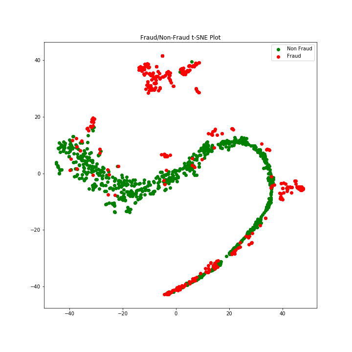
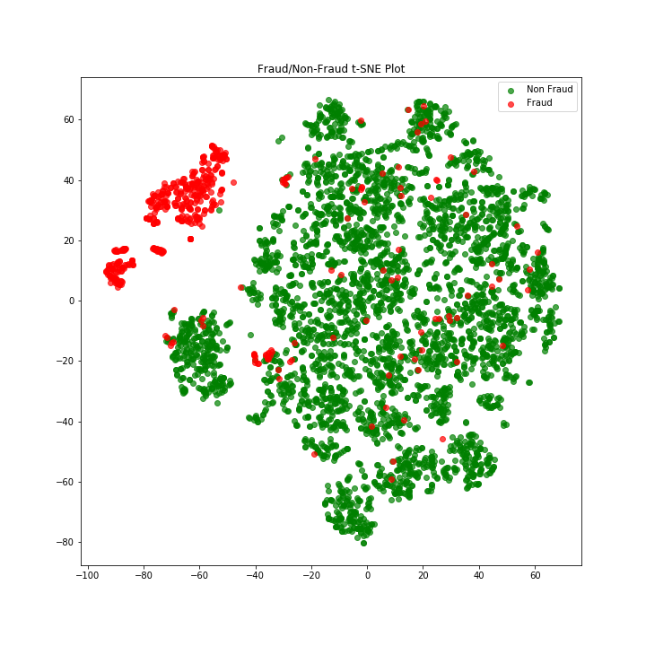
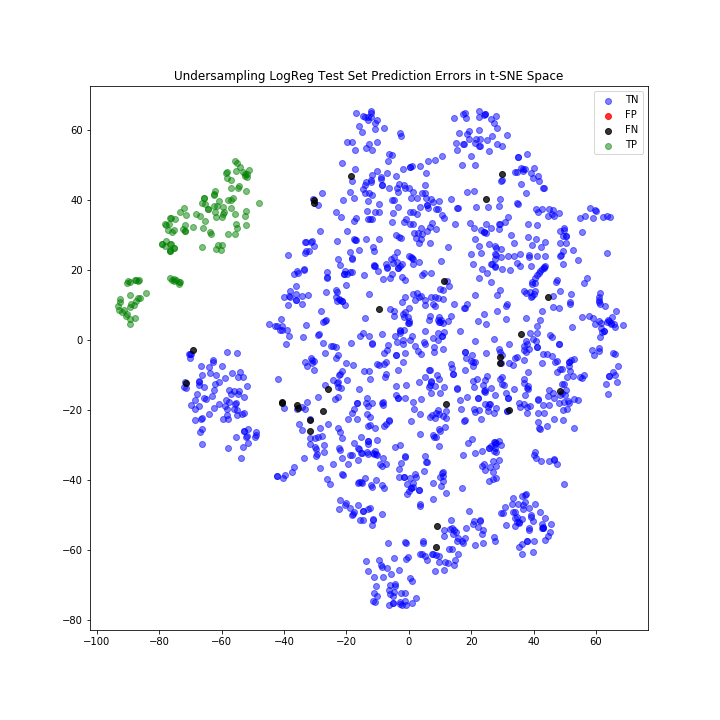

# Using an Autoencoder to Identify Credit Card Fraud
*Author: A. Trahan*  
*Date:   August 2019*

----
## Overview

An autoencoder is a neural netowrk shaped like an hour glass (narrow in the center) that is trained on its own inputs. The goal is to build a simplified latent representation of the inputs (the narrow part) that can still be reliably expanded back to the original dataset. The model is trained on \"good data\ then when anomalous data is submitted to the model it can't be distilled to latent representation the same way, making it easier to separate.

This notebook uses classic and neural network methods to attempt to discover credit card fraud. The dataset contains features generated from anaonymized data from a German bank using PCA, so feature engineering options are limited.

The process consists of:

* Resampled and split the unbalanced dataset
* Train an SVM as a base model, aiming for ROC_AUC and Recall
* Train an autoencoder
 * Visual inspection of autoencoder
    * Use t-SNE to plot initial data in R2
    * Use t-SNE to plot latent representation in R2
 * Train LogReg on latent representation, aiming for ROC_AUC and Recall

----
## Results

Plotting the data and in R2 reveals that the raw data is jumbled, and an SVM provides moderate prediction quality.

    # Results for SVM
    Training ROC_AUC: 0.9822
    Test ROC_AUC: 0.9789

    Training Recall: 0.7942
    Test Recall: 0.7619

When an autoencoder was trained on only non-fraud cases and used to create a latent representation of the data, they appear much more distinct plotted in R2. When splitting that data with a logistic regression, the change in prediction quality is mixed. The autoencoder model provides better Recall on test data (+8%), but its ROC_AUC score is lower (-5%).

    # Results for LogReg on Latent Representations
    Training ROC_AUC: 0.9249
    Test ROC_AUC: 0.9294

    Training Recall: 0.7849
    Test Recall: 0.8243

